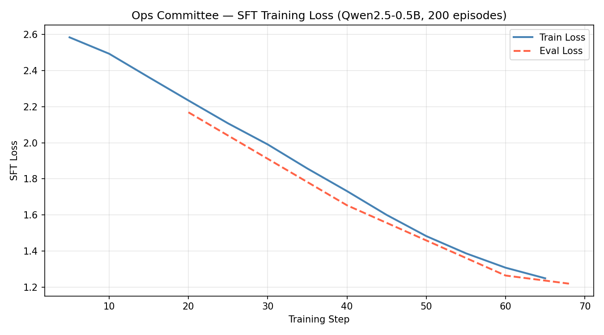
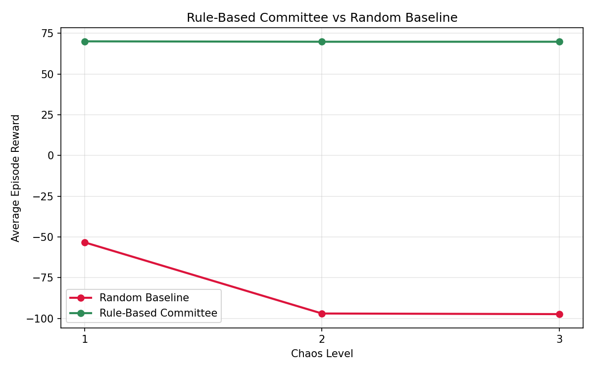

# The Ops Committee

The Ops Committee is an OpenEnv-compatible incident-response environment for
training agents to balance uptime, cost, and security under adversarial faults.

## Winning Blueprint

The environment simulates a generic backend deployment rather than a single
cloud provider. A hidden chaos engine degrades the system, while a committee of
agents must negotiate safe remediation.

Primary themes:

- Theme 1, Multi-Agent: Fixer proposes actions while Banker and Shield audit
  cost and security risk.
- Theme 2, Long-Horizon: early shortcuts create delayed outages, budget drains,
  or policy violations.
- Theme 3, World Modeling: agents reason from logs, alerts, process tables, and
  policy messages instead of raw ground-truth variables.
- Theme 4, Self-Improvement: later phases escalate chaos difficulty based on
  performance history.

## Results


*SFT loss over 200 training episodes across all 3 chaos levels.*



| Policy | Avg Reward | Clean Recovery | Failure Rate |
|--------|----------:|---------------:|-------------:|
| Random approve-all | -82.5 | 11.1% | 55.6% |
| Rule-based committee | +57.7 | 100.0% | 0.0% |

## Phase Status

Phase 1 — Deterministic state machine, partial observability, 3-level chaos curriculum.
Phase 2 — Multi-agent veto protocol: Fixer proposes, Banker and Shield audit.
Phase 3-5 — Composite rubric reward, eval pipeline, TRL training scaffold.

## Local Smoke Test

```powershell
python -m unittest discover tests
python training\eval.py
python scripts\run_demo.py
```

## Training

Run `training/ops_committee_colab.ipynb` on Google Colab (T4 GPU).
Builds a 900+ example SFT corpus, trains with TRL SFTTrainer, saves loss plots.

## Links

- 🤗 HF Space: https://huggingface.co/spaces/YOUR_HF_USERNAME/ops-committee
- 📝 Blog / video: YOUR_LINK_HERE
